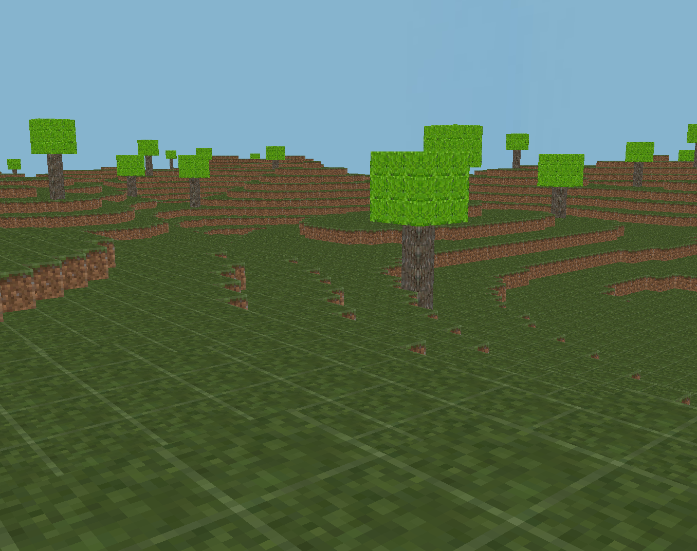

# Minecraft Clone

    

## About
A minecraft-style game built using a proprietary 3D game engine using OpenGL. I decided to work on this to improve my knowledge of 3D graphics and game development.

## Features
* Built on the foundation of a proprietary and scaleable 3D game engine
* Procedural terrain generation
* Efficient chunk mesh creation
* Dynamic chunk loading/unloading support to save render time
* Skybox that can easily be modified

## Building
The application uses CMake to build, you can output to whichever directory you like but the executable must be in the same directory as the `texture` and `shader` folder.
